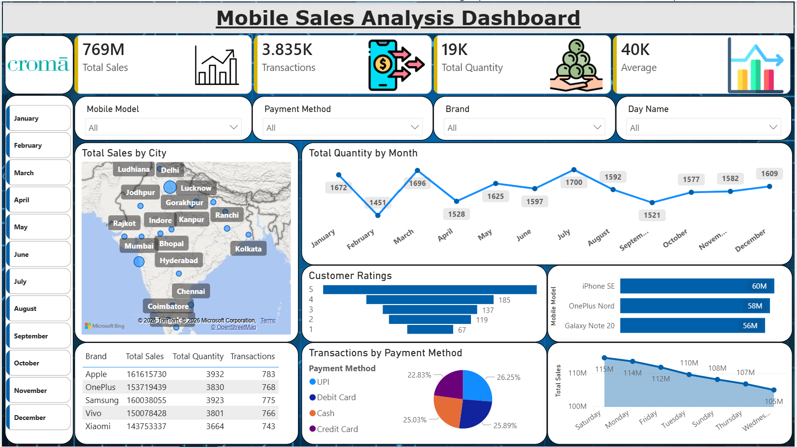

# Mobile Sales Analysis Dashboard

## Objective

Analyze mobile sales trends, customer ratings, payment methods, and brand performance across India using Power BI.

## Tools Used

- Power BI
- DAX
- Excel

## Dashboard Features

- KPI Cards for Total Sales, Transactions, Quantity Sold, and Average Transaction Value
- Interactive Slicers (Month, Brand, Mobile Model, Payment Method, Day Name)
- City-wise Sales Map
- Monthly Quantity Trend
- Customer Ratings Analysis
- Payment Method Analysis
- Brand-wise and Mobile Model-wise Performance

## Key Insights

- Apple generated the highest revenue.
- July recorded the highest quantity sold.
- UPI was the most preferred payment method.
- Delhi and Mumbai contributed significantly to total sales.

## Files Included

- Mobile_Sales_Dashboard.pbix
- Mobile_Sales_Data.csv
- dashboard_preview.jpg
